<div align="center">

# 🐳 Docker — The Complete Beginner's Guide


**Learn Docker from zero to hero.** Everything you need — concepts, architecture, commands, Dockerfiles, multi-stage builds — all in one place.

*No prior Docker knowledge required. Written in simple, easy-to-understand language.*

```
  ╔══════════════════════════════════════════════════════════════╗
  ║                                                              ║
  ║    📦 Package  →  🚢 Ship  →  🚀 Run  →  Anywhere!          ║
  ║                                                              ║
  ╚══════════════════════════════════════════════════════════════╝
```

</div>

---

## 📑 Table of Contents

<details>
<summary><b>📖 Part 1 — Understanding Docker (Concepts & Theory)</b></summary>

| #  | Topic | What You'll Learn |
|----|-------|-------------------|
| 1  | [What is Docker?](#1--what-is-docker) | Core concept & purpose |
| 2  | [What is a Container?](#2--what-is-a-container) | Container anatomy |
| 3  | [Why Docker? The Problem It Solves](#3--why-docker-the-problem-it-solves) | Real-world deployment pain |
| 4  | [Bare Metal Deployment Issues](#4--bare-metal-deployment-issues) | Why the old way fails |
| 5  | [Virtual Machines — The First Fix](#5--virtual-machines--the-first-fix) | VMs pros & cons |
| 6  | [Containers — Next Level Virtualization](#6--containers--next-level-virtualization) | Why containers win |
| 7  | [Best of Both Worlds — VMs + Containers](#7--best-of-both-worlds--vms--containers) | Cloud architecture |

</details>

<details>
<summary><b>⚙️ Part 2 — Docker Architecture & Setup</b></summary>

| #  | Topic | What You'll Learn |
|----|-------|-------------------|
| 8  | [Docker Desktop Architecture (Windows)](#8--docker-desktop-architecture-windows) | How Docker runs on Windows |
| 9  | [Docker Engine](#9--docker-engine) | CLI → API → Daemon flow |
| 10 | [Getting Started with Docker](#10--getting-started-with-docker) | Installation & first run |

</details>

<details>
<summary><b>🏗️ Part 3 — Working with Images & Containers</b></summary>

| #  | Topic | What You'll Learn |
|----|-------|-------------------|
| 11 | [Docker Images vs Containers](#11--docker-images-vs-containers) | Blueprint vs running instance |
| 12 | [Downloading Container Images](#12--downloading-container-images) | `docker pull` in action |
| 13 | [Docker Tags (Image Versioning)](#13--docker-tags-image-versioning) | Version control for images |
| 14 | [Running Containers](#14--running-containers) | `docker run` deep dive |
| 15 | [Naming Containers](#15--naming-containers) | Custom names & uniqueness |
| 16 | [Stopping & Removing Containers](#16--stopping--removing-containers) | Lifecycle management |
| 17 | [Port Mapping](#17--port-mapping) | Connecting host ↔ container |
| 18 | [Entering a Running Container](#18--entering-a-running-container) | `docker exec` interactive |
| 19 | [Docker Volumes (Persistent Storage)](#19--docker-volumes-persistent-storage) | Data that survives restarts |

</details>

<details>
<summary><b>🐋 Part 4 — Building Your Own Docker Images</b></summary>

| #  | Topic | What You'll Learn |
|----|-------|-------------------|
| 20 | [Docker Image Creation Options](#20--docker-image-creation-options) | Dockerfile vs .NET SDK |
| 21 | [Building Images with Dockerfiles](#21--building-images-with-dockerfiles) | How the build process works |
| 22 | [Preparing a .NET App for Containerization](#22--preparing-a-net-app-for-containerization) | `dotnet publish` for Docker |
| 23 | [Writing a Dockerfile](#23--writing-a-dockerfile) | Every instruction explained |
| 24 | [Building a Docker Image](#24--building-a-docker-image) | `docker build` in action |
| 25 | [Multi-Stage Builds](#25--multi-stage-builds) | Optimized production images |
| 26 | [The .dockerignore File](#26--the-dockerignore-file) | Excluding unnecessary files |

</details>

<details>
<summary><b>📋 Part 5 — Cheat Sheets & Reference</b></summary>

| #  | Topic | What You'll Learn |
|----|-------|-------------------|
| 27 | [Docker Commands Cheat Sheet](#27--docker-commands-cheat-sheet) | Every command at a glance |
| 28 | [Dockerfile Instructions Cheat Sheet](#28--dockerfile-instructions-cheat-sheet) | Every Dockerfile keyword |

</details>

---

<div align="center">

# 📖 Part 1 — Understanding Docker

*Before touching any commands, let's understand **WHY** Docker exists and **WHAT** problems it solves.*

</div>

---

## 1. 🐳 What is Docker?

**Docker** is a platform for **packaging and running container-based applications**. It ensures your app works the **same way anywhere** — on your laptop, your colleague's machine, a staging server, or in production.

> 💡 **Think of it like this:** Docker is to software what shipping containers are to international trade. Before shipping containers, loading cargo was chaotic. After? Everything is standardized and works everywhere.

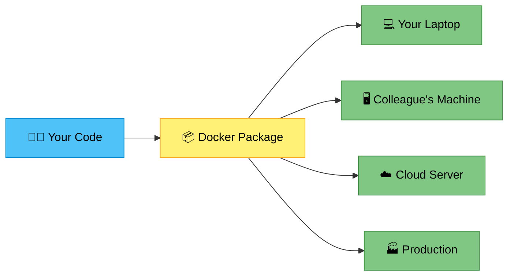

### What Docker Does — The Three Pillars

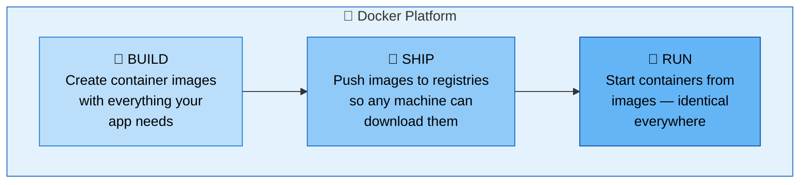

### Key Points

- Docker packages your application along with **everything it needs** (code, runtime, libraries, settings) into a single unit called a **container**.
- Containers are **lightweight**, **portable**, and **isolated** from each other.
- Docker makes it easy to **build**, **ship**, and **run** applications anywhere.
- No more **"it works on my machine"** excuses — if it works in Docker, it works everywhere.

[🔝 Back to Top](#-table-of-contents)

---

## 2. 📦 What is a Container?

A **container** is a lightweight, standalone, executable package that includes **everything needed** to run your application. It bundles your code with all its dependencies so the app runs the same on every machine.

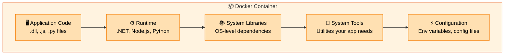

### Containers vs Traditional Apps

| Feature | ❌ Traditional App | ✅ Containerized App |
|---------|-------------------|---------------------|
| Dependencies | Installed on host OS — can conflict with other apps | Bundled **inside** container — no conflicts |
| Isolation | Shares everything with OS and other apps | Fully **isolated** — own filesystem, network, processes |
| Portability | Hard to move — depends on host configuration | Runs **anywhere** Docker is installed |
| Environment | Varies by machine — "works on my machine" problem | **Always the same** — identical across all environments |
| Startup | Depends on host — minutes to configure | **Seconds** — everything is pre-packaged |

> 💡 **Key takeaway:** A container is like a mini-computer inside your computer. It has its own files, its own network, and its own processes. But unlike a full virtual machine, it shares the host OS kernel — making it incredibly lightweight.

[🔝 Back to Top](#-table-of-contents)

---

## 3. 🤔 Why Docker? The Problem It Solves

To understand **why** Docker was created, let's look at how software deployment worked **before** Docker.

### The Old Way — Before Virtualization

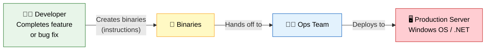

The developer finishes a feature, creates the binaries, and hands them to the operations team. The ops team deploys those binaries to the production server.

### 💥 Then... the App CRASHES in Production!

The team has to investigate what went wrong:

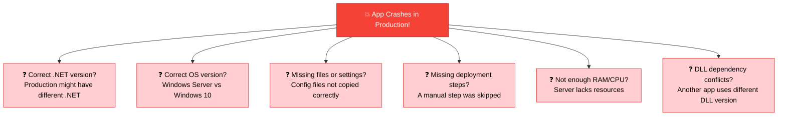

When asked, the developer says:

> 🤷‍♂️ **"It works on my machine!"**

**This is the #1 problem Docker solves.** With Docker, the developer's entire environment is **packaged and shipped** alongside the application. If it runs in Docker, it runs everywhere.

[🔝 Back to Top](#-table-of-contents)

---

## 4. 🖥️ Bare Metal Deployment Issues

The traditional deployment method is called **Bare Metal Deployment** — deploying directly to a physical host machine.

### Bare Metal Server Stack

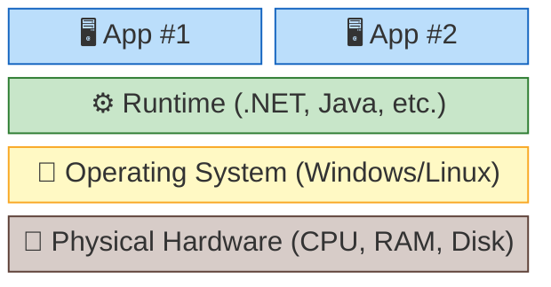

### ❌ Problems with Bare Metal

| Category | Issue | Impact |
|----------|-------|--------|
| **Version** | OS / .NET runtime version mismatch | App fails to start or behaves differently |
| **Configuration** | Missing files / settings | Features break or app crashes |
| **Resources** | Not enough hardware (RAM/CPU) | Slow performance or out-of-memory errors |
| **Conflicts** | DLL dependency conflicts | Two apps need different versions of same library |
| **Security** | Missing permissions | App can't access files or network resources |
| **Paths** | Hardcoded paths | Paths on dev machine don't exist on server |
| **Network** | Ports already in use | Another app is already using the needed port |
| **Scale** | Not enough servers | Can't handle increased traffic |
| **Waste** | Wasted hardware resources | Server sits idle most of the time |
| **Speed** | Very slow provisioning | Setting up new server takes **hours/days** |
| **Recovery** | How to rollback? | No easy way to go back to previous version |

> 💡 **The connection:** All these problems exist because the app is **tightly coupled** to the host machine. Docker solves this by **decoupling** the app from the host — the app carries its own environment.

[🔝 Back to Top](#-table-of-contents)

---

## 5. ⚔️ Virtual Machines — The First Fix

**Virtual Machines (VMs)** were created to solve many of the bare metal deployment issues. Let's see how they work and why they weren't the complete solution.

### How VMs Work

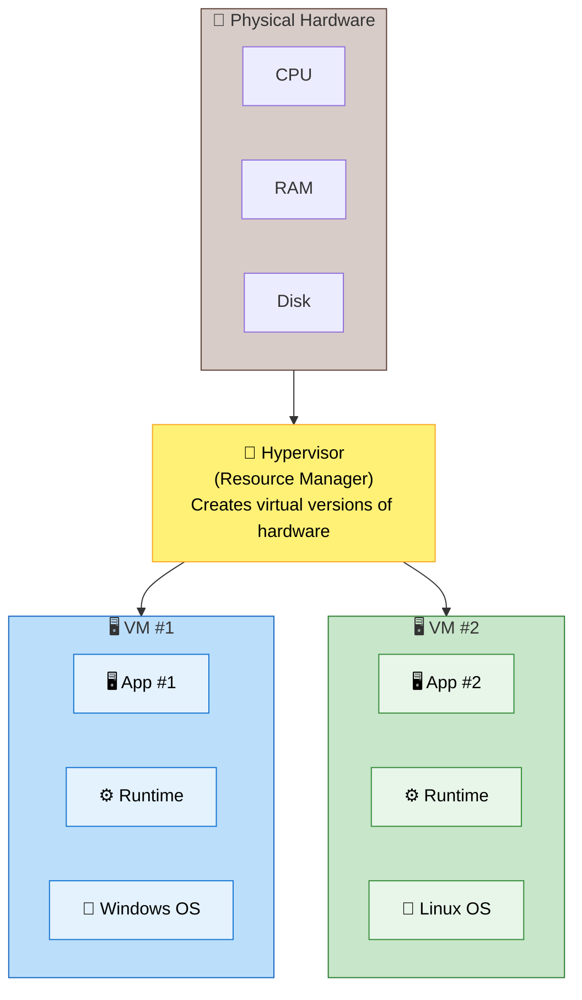

> 🔑 **Hypervisor** = A resource manager. It takes your physical hardware and creates **virtual versions** of CPU, RAM, and disk — allowing multiple VMs to safely share the same physical computer. Each VM gets its own **full operating system**.

### ✅ Benefits of VMs

| Benefit | Description |
|---------|-------------|
| ✅ OS / Runtime match | Each VM has its own OS and runtime — no conflicts |
| ✅ Clean environment | Fresh environment for each application |
| ✅ Better resource allocation | Allocate specific RAM, CPU, and disk to each VM |
| ✅ Built-in permissions | Each VM has its own user and permission system |
| ✅ Predictable paths | File paths are consistent inside each VM |
| ✅ Easier to scale | Spin up more VMs as needed |
| ✅ Faster provisioning | Set up a new VM in **minutes** (vs hours for bare metal) |
| ✅ Simpler rollback | Snapshot and restore VM states easily |

### ❌ But VMs Still Have Issues...

| Issue | Impact | Severity |
|-------|--------|----------|
| Significant RAM / disk overhead | Each VM needs a **full OS** — uses GBs of resources | 🔴 High |
| VM image creation pain | Creating VM images takes **hours** | 🔴 High |
| VM provisioning too slow | Spinning up a VM takes **minutes** | 🟡 Medium |
| Boot time too slow | VM boot takes **minutes** | 🟡 Medium |
| Limited VMs per server | Hardware resources run out quickly | 🟡 Medium |
| Wasted resources | Many VMs sit idle but still consume memory | 🟡 Medium |
| Multiple OS patches | Each VM's OS needs individual updates | 🔴 High |
| Hard to version control | VM images are large and hard to track | 🟡 Medium |

> 💡 **The connection:** VMs fixed the isolation problem but introduced a **resource overhead** problem. Each VM carries a full OS (Windows = ~10GB, Linux = ~2GB). That's a lot of wasted space and memory when you only need to run a small app. **Containers solve this.**

[🔝 Back to Top](#-table-of-contents)

---

## 6. 🚀 Containers — Next Level Virtualization

Containers are the **next evolution** of virtualization. They keep the benefits of VMs (isolation, consistency) while eliminating the overhead (full OS per instance).

### The Key Difference: Shared Kernel

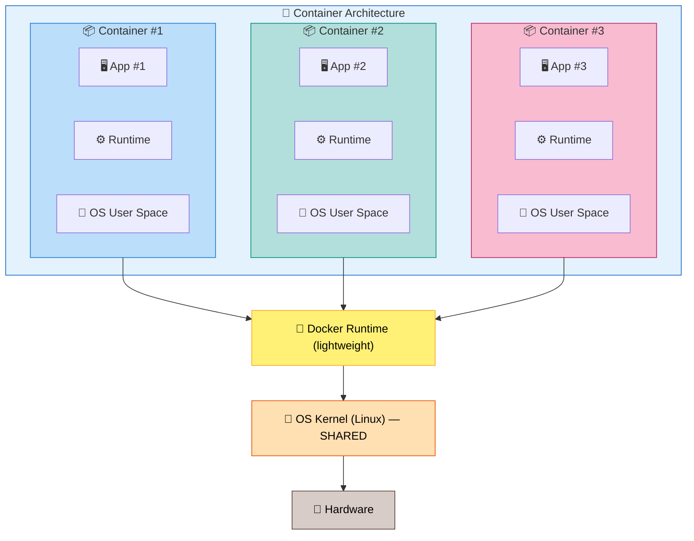

> 🔑 **Key insight:** Containers **share** the host OS kernel. They only package the **user space** (app code, runtime, libraries) — NOT a full operating system. This makes them incredibly lightweight and fast.

### ✅ Benefits of Containers

| Benefit | Description | Compared to VMs |
|---------|-------------|-----------------|
| ⚡ Minimal resource overhead | No full OS per container | VMs need full OS per instance |
| ⚡ Near-instant image creation | Building takes **seconds** | VM images take **hours** |
| ⚡ Fast provisioning | Starts in **seconds** | VMs take **minutes** |
| 🔒 Environment consistency | Identical in dev, staging, prod | VMs can drift over time |
| 📦 High density | Run **hundreds** per server | VMs: only **tens** per server |
| 💰 Efficient resource usage | Uses only what it needs | VMs allocate fixed resources |
| 🏷️ Built-in versioning | Easy to version and track | VM images are hard to version |

### 🏆 The Evolution — Side by Side

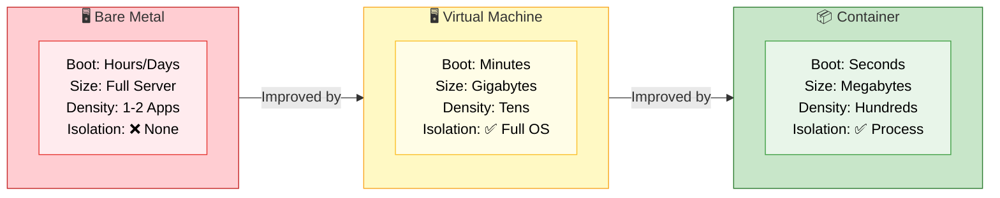

| Feature | 🖥️ Bare Metal | 🖥️ Virtual Machine | 📦 Container |
|---------|:-----------:|:-----------------:|:----------:|
| Boot time | Hours/Days | Minutes | **Seconds** ✅ |
| Size | Full server | Gigabytes | **Megabytes** ✅ |
| Performance | Native | Near-native | **Near-native** ✅ |
| OS | Shared host OS | Full OS per VM | **Shared kernel** ✅ |
| Isolation | ❌ None | ✅ Complete | ✅ Process-level |
| Resource usage | Heavy waste | Moderate waste | **Efficient** ✅ |
| Density per server | 1-2 apps | Tens of VMs | **Hundreds** ✅ |
| Provisioning | Hours/Days | Minutes | **Seconds** ✅ |

[🔝 Back to Top](#-table-of-contents)

---

## 7. 🏆 Best of Both Worlds — VMs + Containers

In real-world **production environments**, cloud providers combine **both** VMs and containers:

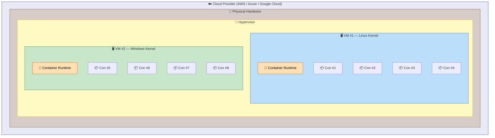

> 🔑 **This is exactly what cloud providers like AWS, Azure, and Google Cloud use:**
> - **VMs** provide **hardware-level isolation** (security boundary between customers)
> - **Containers inside VMs** provide **application-level isolation** (efficient app packaging)

### Why Both?

| Layer | Purpose | What it Provides |
|-------|---------|------------------|
| **VMs** | Security boundary | Hardware-level isolation between different customers |
| **Containers** | Application packaging | Lightweight, fast, efficient app deployment |

[🔝 Back to Top](#-table-of-contents)

---

<div align="center">

# ⚙️ Part 2 — Docker Architecture & Setup

*Now that you understand WHY Docker exists, let's see HOW it works under the hood.*

</div>

---

## 8. 🏗️ Docker Desktop Architecture (Windows)

When you install **Docker Desktop** on Windows, here's what happens behind the scenes:

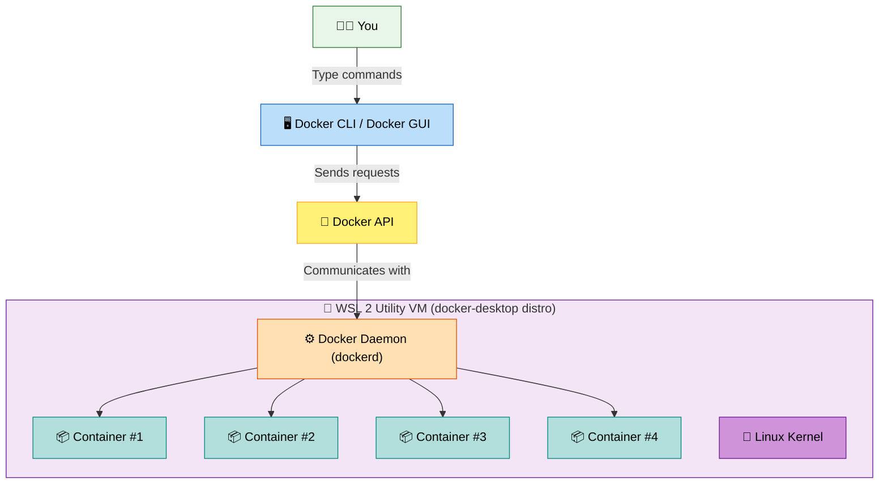

### Step-by-Step: What Happens When You Run a Command

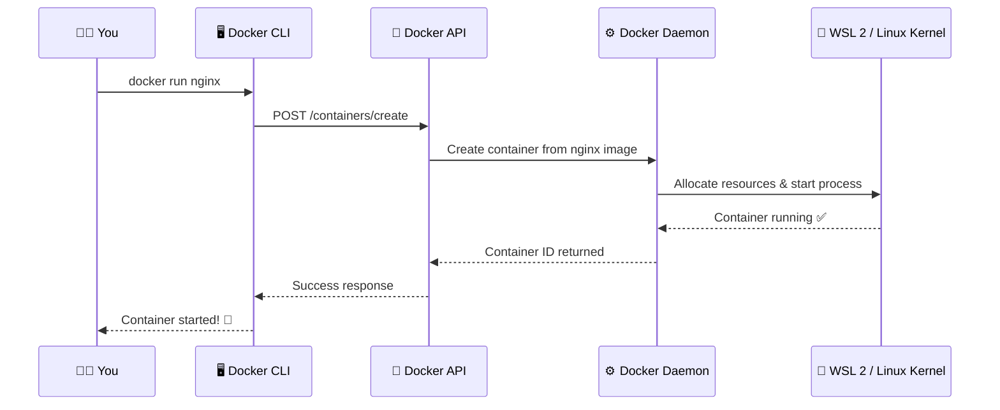

### What is WSL 2?

**WSL 2** (Windows Subsystem for Linux 2) is a feature of Windows that lets you run a **real Linux kernel** directly on Windows. Docker Desktop uses WSL 2 to run the Linux-based Docker engine on your Windows machine.

| Component | Role | Where it Runs |
|-----------|------|---------------|
| **Docker CLI / GUI** | Where you type commands or click buttons | Windows |
| **Docker API** | Translates your commands into API calls | Windows |
| **Docker Daemon** | The engine that does the actual work | Inside WSL 2 (Linux) |
| **Containers** | Your running applications | Inside WSL 2 (Linux) |
| **Linux Kernel** | The OS kernel shared by all containers | WSL 2 |

[🔝 Back to Top](#-table-of-contents)

---

## 9. ⚙️ Docker Engine

**Docker Engine** is the core technology that allows you to **build**, **run**, and **manage** containers. It has three components that work together:

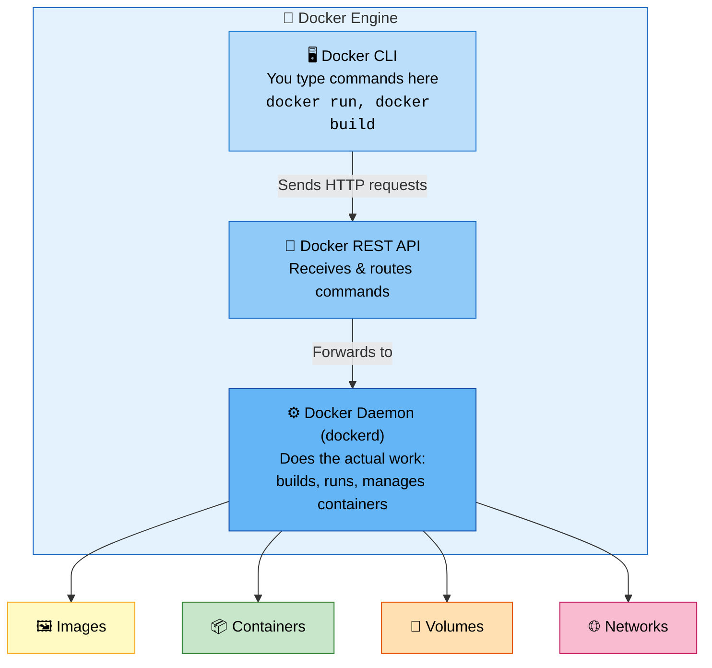

| Component | What it Does | Example |
|-----------|-------------|---------|
| **Docker CLI** | The command-line tool where you type Docker commands | `docker run nginx` |
| **Docker API** | A REST API that receives commands from the CLI and forwards them | `POST /containers/create` |
| **Docker Daemon** | The background process (`dockerd`) that builds, runs, and manages containers, images, volumes, and networks | Pulls images, starts containers |

[🔝 Back to Top](#-table-of-contents)

---

## 10. 🚀 Getting Started with Docker

### Prerequisites

1. **Install Docker Desktop** from [docker.com](https://www.docker.com/products/docker-desktop/)
2. During installation, make sure **WSL 2** is enabled (Docker Desktop will guide you)
3. After installation, open Docker Desktop and wait for it to start (the whale icon in the taskbar should be steady)

### Step 1: Verify Installation

Open your terminal (PowerShell, Command Prompt, or any terminal) and run:

```bash
docker version
```

This shows the installed Docker version for both the **Client** (CLI) and **Server** (daemon). If you see both — Docker is working! ✅

### Step 2: Run Your First Container 🎉

```bash
docker run hello-world
```

**What happens behind the scenes:**

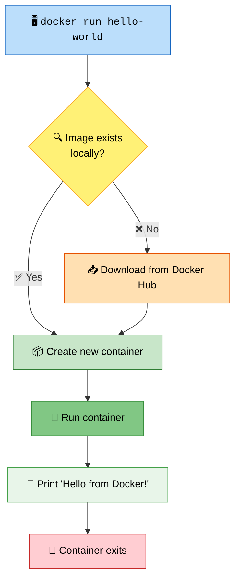

If you see **"Hello from Docker!"** — congratulations! 🎉 Docker is set up correctly.

> 💡 **Connection to next topic:** The `hello-world` image you just ran was downloaded from Docker Hub. But what exactly is an image? And how is it different from a container? That's what we'll learn next.

[🔝 Back to Top](#-table-of-contents)

---

<div align="center">

# 🏗️ Part 3 — Working with Images & Containers

*Time to get hands-on! Let's learn the core Docker commands and concepts.*

</div>

---

## 11. 🖼️ Docker Images vs Containers

This is one of the **most important** concepts in Docker. Understanding the difference between images and containers is key to everything else.

### Docker Image = Blueprint

A **Docker Image** is a **blueprint/template** that contains everything needed to run your application. It's **read-only** — you can't change it once built.

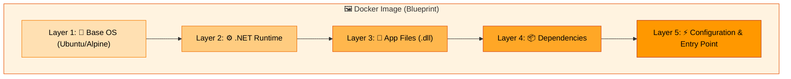

> 🔑 Each step in creating a Docker image is called a **layer**. Layers are stacked on top of each other, and each one represents a specific instruction.

### Container = Running Instance

A **Container** is a **running instance** of an image — an isolated environment with its own filesystem, networking, and processes.

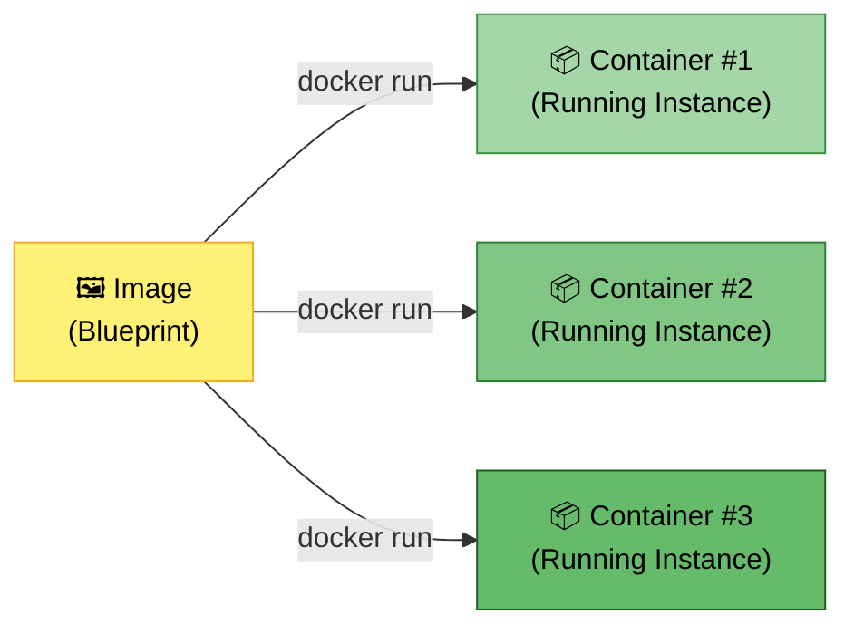

> 💡 You can create **many containers** from a **single image**, just like you can create many objects from a single class in programming.

### Image vs Container — Side by Side

| Aspect | 🖼️ Image | 📦 Container |
|--------|---------|-------------|
| **What is it?** | Blueprint / Template | Running Instance |
| **State** | Read-only (immutable) | Read-write (temporary) |
| **Analogy** | Class in programming | Object (instance) of that class |
| **Analogy 2** | Recipe | The cooked meal |
| **Storage** | Stored in registry (Docker Hub) | Exists on the host machine |
| **Lifecycle** | Built once, shared everywhere | Created, started, stopped, destroyed |

### Where Do Images Live? — Container Registry

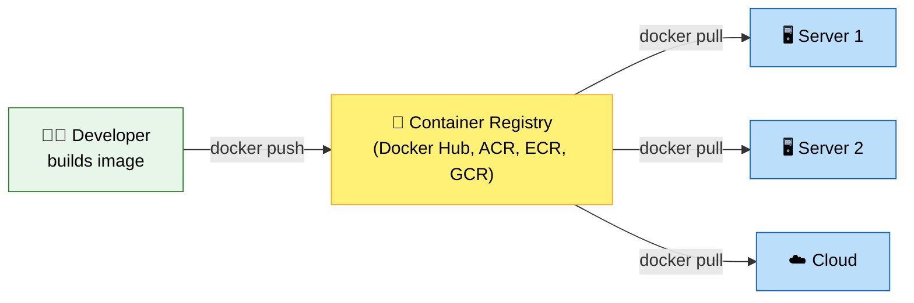

| Registry | Provider | URL |
|----------|----------|-----|
| **Docker Hub** | Docker (default, public) | hub.docker.com |
| **ACR** | Microsoft Azure | azure.microsoft.com |
| **ECR** | Amazon AWS | aws.amazon.com |
| **GCR** | Google Cloud | cloud.google.com |

[🔝 Back to Top](#-table-of-contents)

---

## 12. 📥 Downloading Container Images

Use `docker pull` to download images from a container registry (Docker Hub by default).

### Example: Pull the Nginx Image

```bash
docker pull nginx
```

**Output:**
```
Using default tag: latest
latest: Pulling from library/nginx
d26f27cc8c41: Pull complete     ← Layer 1
3c7ab7949321: Pull complete     ← Layer 2
cacfcdd01f30: Pull complete     ← Layer 3
062e450697fa: Pull complete     ← Layer 4
b6698f04e005: Pull complete     ← Layer 5
82454cdbf456: Pull complete     ← Layer 6
2bedaf25031a: Pull complete     ← Layer 7
Status: Downloaded newer image for nginx:latest
docker.io/library/nginx:latest
```

> 💡 Each `Pull complete` line represents a **layer** being downloaded. Remember — images are built in layers!

### List All Downloaded Images

```bash
docker images
```

**Output:**
```
IMAGE                ID             DISK USAGE   CONTENT SIZE   EXTRA
hello-world:latest   c3cbe1cc1aa5       25.9kB         9.49kB    U
nginx:latest         5a88c9c45479        241MB           66MB
```

### How `docker pull` Works

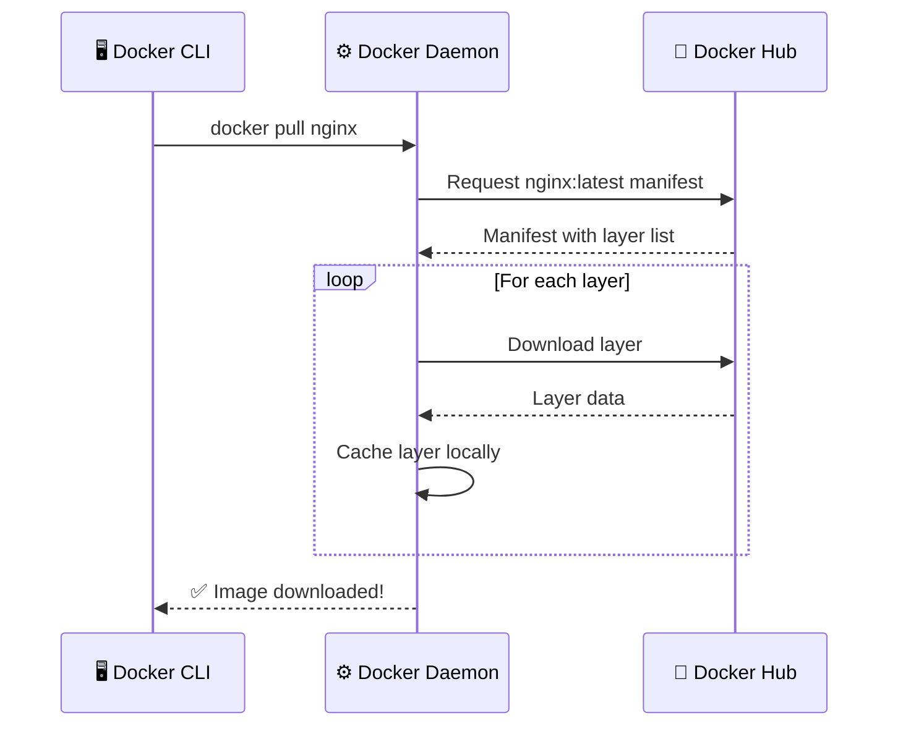

### Key Commands

| Command | Description |
|---------|-------------|
| `docker pull <image>` | Download an image (uses `:latest` tag by default) |
| `docker pull <image>:<tag>` | Download a specific version |
| `docker images` | List all local images |

[🔝 Back to Top](#-table-of-contents)

---

## 13. 🏷️ Docker Tags (Image Versioning)

**Tags** are labels attached to images to identify different **versions**. They work like version numbers.

### How Tags Work

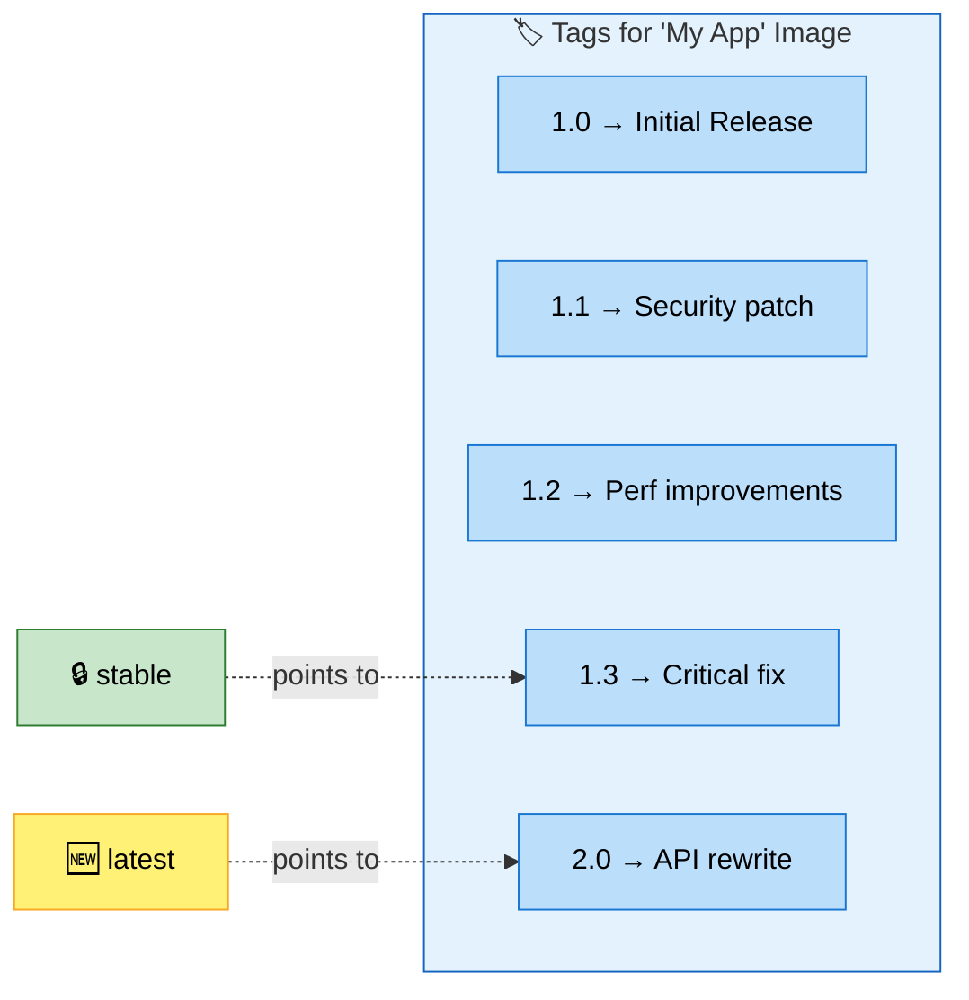

### Key Points About Tags

- **One image can have multiple tags** — version `2.0` could be tagged as both `2.0` and `latest`
- Teams choose between **stability** (`stable` or specific version) or **newest features** (`latest`)
- The `latest` tag isn't always the newest — it's whatever the maintainer decides to tag

### Example: Pull a Specific Version

```bash
docker pull nginx:1.30.4
```

**Output:**
```
1.30.4: Pulling from library/nginx
18079b307127: Pull complete
ac47ae235161: Pull complete
...
Status: Downloaded newer image for nginx:1.30.4
docker.io/library/nginx:1.30.4
```

### Verify Multiple Versions

```bash
docker images
```

```
IMAGE                ID             DISK USAGE   CONTENT SIZE
hello-world:latest   c3cbe1cc1aa5       25.9kB         9.49kB
nginx:1.30.4         5cf90903deda        240MB           66MB
nginx:latest         5a88c9c45479        241MB           66MB
```

> 🔍 Notice: `nginx:1.30.4` and `nginx:latest` have **different image IDs** — they are different versions!

### Best Practices

| Environment | Recommended Tag | Why |
|-------------|----------------|-----|
| 🧪 Development | `latest` | Quick testing, always newest |
| 🏭 Production | Specific version (e.g., `1.30.4`) | Predictable, won't change unexpectedly |
| 🔒 Stable release | `stable` or pinned version | Tested and verified |

[🔝 Back to Top](#-table-of-contents)

---

## 14. 🏃 Running Containers

The `docker run` command is the most important Docker command. It creates and starts a new container from an image.

### Basic Run (Foreground / Attached Mode)

```bash
docker run nginx
```

This runs nginx in the **foreground** — you see the logs in your terminal. Press `Ctrl + C` to stop.

### Run in Background (Detached Mode) — Most Common

```bash
docker run -d nginx
```

The `-d` flag runs the container in the **background**. Docker prints the container ID and gives you back your terminal.

### List Running Containers

```bash
docker ps
```

```
CONTAINER ID   IMAGE   COMMAND                  CREATED          STATUS          PORTS     NAMES
e5353f1e1361   nginx   "/docker-entrypoint.…"   30 seconds ago   Up 27 seconds   80/tcp    nginx-test
```

### List ALL Containers (Including Stopped)

```bash
docker ps --all
```

```
CONTAINER ID   IMAGE         COMMAND                  CREATED          STATUS                      NAMES
cef6b7d97cc2   nginx         "/docker-entrypoint.…"   2 minutes ago    Exited (0) 1 minute ago     magical_herschel
715d200f5d2b   hello-world   "/hello"                 54 minutes ago   Exited (0) 53 minutes ago   objective_matsumoto
```

### ⚠️ Important: Every `docker run` Creates a NEW Container

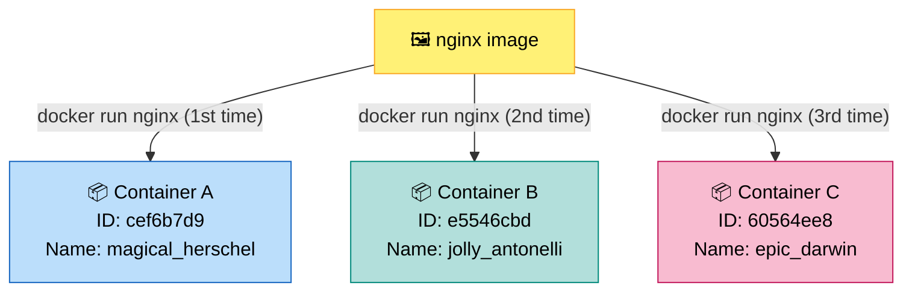

> ⚠️ Each `docker run` creates a **completely new, independent container**. They don't share data or state.

### Common `docker run` Flags

| Flag | Full Form | Purpose | Example |
|------|-----------|---------|---------|
| `-d` | `--detach` | Run in background | `docker run -d nginx` |
| `--name` | `--name` | Give container a name | `docker run --name my-app nginx` |
| `--rm` | `--rm` | Auto-remove when stopped | `docker run --rm nginx` |
| `-p` | `--publish` | Map ports (host:container) | `docker run -p 8080:80 nginx` |
| `-v` | `--volume` | Mount a volume | `docker run -v data:/app/data nginx` |
| `-it` | `--interactive --tty` | Interactive terminal | `docker run -it ubuntu /bin/bash` |
| `-e` | `--env` | Set environment variable | `docker run -e MY_VAR=hello nginx` |

[🔝 Back to Top](#-table-of-contents)

---

## 15. 📛 Naming Containers

By default, Docker gives containers **random funny names** like `magical_herschel` or `jolly_antonelli`. Use `--name` to give meaningful names.

### Run with a Custom Name

```bash
docker run -d --name nginx-test nginx
```

```bash
docker ps
```
```
CONTAINER ID   IMAGE   COMMAND                  CREATED          STATUS          PORTS     NAMES
e5353f1e1361   nginx   "/docker-entrypoint.…"   30 seconds ago   Up 27 seconds   80/tcp    nginx-test
```

### ⚠️ Container Names Must Be Unique

If you try to create a container with a name that's **already in use** (even if stopped):

```bash
docker run -d --name nginx-test nginx
```
```
docker: Error response from daemon: Conflict. The container name "/nginx-test"
is already in use by container "e5353f1e1361...".
You have to remove (or rename) that container to be able to reuse that name.
```

**Solution:** Remove the old container first → then create a new one with that name.

```mermaid
graph LR
    A["❌ Can't create<br/>name already exists"] 
    --> B["🗑️ docker rm nginx-test<br/>Remove old container"]
    --> C["✅ docker run --name nginx-test nginx<br/>Now it works!"]

    style A fill:#FFCDD2,stroke:#C62828,color:#000
    style B fill:#FFF9C4,stroke:#F9A825,color:#000
    style C fill:#C8E6C9,stroke:#2E7D32,color:#000
```

[🔝 Back to Top](#-table-of-contents)

---

## 16. 🛑 Stopping & Removing Containers

### Container Lifecycle

```mermaid
graph LR
    CREATE["📦 Created<br/><code>docker create</code>"]
    --> START["▶️ Running<br/><code>docker start</code>"]
    --> STOP["⏹️ Stopped<br/><code>docker stop</code>"]
    --> REMOVE["🗑️ Removed<br/><code>docker rm</code>"]
    
    START -->|"docker run combines<br/>create + start"| START
    STOP -->|"docker start<br/>(restart)"| START

    style CREATE fill:#BBDEFB,stroke:#1565C0,color:#000
    style START fill:#C8E6C9,stroke:#2E7D32,color:#000
    style STOP fill:#FFF9C4,stroke:#F9A825,color:#000
    style REMOVE fill:#FFCDD2,stroke:#C62828,color:#000
```

### Stop a Running Container

```bash
docker stop nginx-test
```

The container is **stopped** but still exists (you can restart it).

### Remove a Stopped Container

```bash
docker rm nginx-test
```

The container is **permanently deleted**.

### ⚠️ Cannot Remove a Running Container

```bash
docker rm nginx-test
```
```
Error: cannot remove container "nginx-test": container is running:
stop the container before removing or force remove
```

### Force Remove a Running Container

```bash
docker rm nginx-test --force
```

This **stops + removes** in one command.

### 🌟 Auto-Remove on Stop (`--rm` Flag) — Best Practice for Testing

```bash
docker run -d --rm --name nginx-test nginx
```

```mermaid
graph LR
    RUN["▶️ docker run --rm<br/>Container starts"]
    --> RUNNING["🟢 Running..."]
    --> STOP["⏹️ docker stop<br/>Container stops"]
    --> GONE["🗑️ Automatically removed!<br/>No manual cleanup needed"]

    style RUN fill:#C8E6C9,stroke:#2E7D32,color:#000
    style RUNNING fill:#A5D6A7,stroke:#388E3C,color:#000
    style STOP fill:#FFF9C4,stroke:#F9A825,color:#000
    style GONE fill:#FFCDD2,stroke:#C62828,color:#000
```

### Complete Lifecycle Commands

| Command | What it Does | Container State After |
|---------|-------------|----------------------|
| `docker run <image>` | Create + Start | ▶️ Running |
| `docker run -d <image>` | Create + Start (background) | ▶️ Running |
| `docker run --rm <image>` | Create + Start (auto-cleanup) | ▶️ Running → 🗑️ Gone |
| `docker stop <container>` | Gracefully stop | ⏹️ Stopped (still exists) |
| `docker start <container>` | Restart a stopped container | ▶️ Running |
| `docker rm <container>` | Delete a stopped container | 🗑️ Removed |
| `docker rm --force <container>` | Stop + Delete in one step | 🗑️ Removed |
| `docker ps` | List running containers | — |
| `docker ps --all` | List ALL containers | — |

[🔝 Back to Top](#-table-of-contents)

---

## 17. 🔌 Port Mapping

By default, Docker containers are **completely isolated** from the host network. Even if nginx is listening on port 80 inside the container, you **can't access it** from your browser.

### ❌ Without Port Mapping — Can't Access

```mermaid
graph LR
    BROWSER["🌐 Browser<br/>localhost:80"] 
    -->|"❌ BLOCKED"| WALL["🧱 Network Isolation"]
    WALL -->|"❌"| CONTAINER["📦 Container<br/>nginx:80"]

    style BROWSER fill:#BBDEFB,stroke:#1565C0,color:#000
    style WALL fill:#FFCDD2,stroke:#C62828,color:#000
    style CONTAINER fill:#C8E6C9,stroke:#2E7D32,color:#000
```

### ✅ With Port Mapping — Accessible!

Port mapping creates a **tunnel** between your host machine and the container:

```mermaid
graph LR
    BROWSER["🌐 Browser<br/>localhost:8080"]
    -->|"✅ Mapped!"| HOST["🔌 Host Port 8080"]
    -->|"Tunnel"| CONTAINER["📦 Container Port 80<br/>nginx"]

    style BROWSER fill:#BBDEFB,stroke:#1565C0,color:#000
    style HOST fill:#FFF176,stroke:#F9A825,color:#000
    style CONTAINER fill:#C8E6C9,stroke:#2E7D32,color:#000
```

### Syntax

```
docker run -p <HOST_PORT>:<CONTAINER_PORT> <image>
                  ↑              ↑
           Your machine    Inside container
```

### Example: Map Host 8080 → Container 80

```bash
docker run -d --rm -p 8080:80 --name nginx-test nginx
```

```bash
docker ps
```
```
CONTAINER ID   IMAGE   COMMAND                  PORTS                                     NAMES
9267b6550ee3   nginx   "/docker-entrypoint.…"   0.0.0.0:8080->80/tcp, [::]:8080->80/tcp   nginx-test
```

Now open your browser → **http://localhost:8080/** 🎉

> **Welcome to nginx!**
> If you see this page, nginx is successfully installed and working.

### Port Mapping Examples

```mermaid
graph LR
    subgraph HOST["🖥️ Host Machine"]
        H1["Port 8080"]
        H2["Port 3000"]
        H3["Port 5000"]
    end
    
    subgraph DOCKER["🐳 Docker"]
        C1["📦 nginx<br/>Port 80"]
        C2["📦 node-app<br/>Port 3000"]
        C3["📦 api<br/>Port 8080"]
    end

    H1 -->|"-p 8080:80"| C1
    H2 -->|"-p 3000:3000"| C2
    H3 -->|"-p 5000:8080"| C3

    style HOST fill:#BBDEFB,stroke:#1565C0
    style DOCKER fill:#C8E6C9,stroke:#2E7D32
```

| Command | What it Maps |
|---------|-------------|
| `-p 8080:80` | Host 8080 → Container 80 |
| `-p 3000:3000` | Host 3000 → Container 3000 (same port) |
| `-p 5000:8080` | Host 5000 → Container 8080 |
| `-p 80:80 -p 443:443` | Map multiple ports |

> 💡 **Key insight:** The **container port** is fixed (determined by what your app listens on). The **host port** is your choice — pick any available port on your machine.

[🔝 Back to Top](#-table-of-contents)

---

## 18. 🔧 Entering a Running Container

Sometimes you need to go **inside** a running container to inspect files, debug issues, or make temporary changes.

### Command: `docker exec`

```bash
docker exec -it <container_name> /bin/bash
```

| Flag | Meaning |
|------|---------|
| `-i` | **Interactive** — keeps STDIN open (you can type) |
| `-t` | **TTY** — gives you a terminal prompt |
| `-it` | Combination — interactive terminal session |

### Example: Enter the Nginx Container & Modify Homepage

```mermaid
graph TD
    A["1️⃣ Start nginx container<br/><code>docker run -d --rm -p 8080:80 --name nginx-test nginx</code>"]
    --> B["2️⃣ Enter the container<br/><code>docker exec -it nginx-test /bin/bash</code>"]
    --> C["3️⃣ Navigate to HTML folder<br/><code>cd /usr/share/nginx/html</code>"]
    --> D["4️⃣ Modify the homepage<br/><code>echo '&lt;h1&gt;Hello from Kartik&lt;/h1&gt;' > index.html</code>"]
    --> E["5️⃣ Open browser → localhost:8080<br/>See your changes! 🎉"]
    --> F["6️⃣ Exit the container<br/><code>exit</code>"]

    style A fill:#BBDEFB,stroke:#1565C0,color:#000
    style B fill:#B2DFDB,stroke:#00897B,color:#000
    style C fill:#FFF9C4,stroke:#F9A825,color:#000
    style D fill:#FFE0B2,stroke:#E65100,color:#000
    style E fill:#C8E6C9,stroke:#2E7D32,color:#000
    style F fill:#F8BBD0,stroke:#C2185B,color:#000
```

**Step 1:** Start the container

```bash
docker run -d --rm -p 8080:80 --name nginx-test nginx
```

**Step 2:** Enter the container

```bash
docker exec -it nginx-test /bin/bash
```

You're now **inside** the container as root:

```bash
root@f13262e3578b:/# ls
bin  boot  dev  docker-entrypoint.d  docker-entrypoint.sh  etc  home  lib  lib64
media  mnt  opt  proc  root  run  sbin  srv  sys  tmp  usr  var
```

**Step 3:** Navigate and modify

```bash
root@f13262e3578b:/# cd /usr/share/nginx/html
root@f13262e3578b:/usr/share/nginx/html# ls
50x.html  index.html
root@f13262e3578b:/usr/share/nginx/html# echo "<h1>Hello world from Kartik</h1>" > index.html
```

**Step 4:** Open browser → `http://localhost:8080/` → See **"Hello world from Kartik"** 🎉

**Step 5:** Exit

```bash
root@f13262e3578b:/usr/share/nginx/html# exit
```

### ⚠️ Changes Are NOT Persistent!

```mermaid
graph LR
    C1["📦 Container running<br/>Changes made ✅"] 
    -->|"docker stop"| GONE["🗑️ Container removed<br/>Changes LOST ❌"]
    -->|"docker run (new)"| C2["📦 New container<br/>Default content<br/>No changes!"]

    style C1 fill:#C8E6C9,stroke:#2E7D32,color:#000
    style GONE fill:#FFCDD2,stroke:#C62828,color:#000
    style C2 fill:#BBDEFB,stroke:#1565C0,color:#000
```

> ⚠️ Any changes made inside a container are **lost** when the container is stopped/destroyed. The container's filesystem is **ephemeral** (temporary). To persist data, use **Docker Volumes** → next section!

[🔝 Back to Top](#-table-of-contents)

---

## 19. 💾 Docker Volumes (Persistent Storage)

### The Problem

When you stop/destroy a container, all data inside it is **lost**. This is by design — containers are meant to be ephemeral (disposable).

### The Solution — Docker Volumes

A **Volume** is a persistent storage area **managed by Docker**. Data in a volume survives container stops, restarts, and even deletion.

### How Volumes Work

```mermaid
graph TD
    subgraph STEP1["Step 1: Container writes data to volume"]
        C1["📦 Container #1<br/>(running)"]
        -->|"writes to"| V1["💾 Volume: my-data<br/>data/some data ✅"]
    end
    
    subgraph STEP2["Step 2: Container is destroyed"]
        C1X["📦 Container #1<br/>🗑️ DESTROYED"]
        V2["💾 Volume: my-data<br/>data/some data ✅<br/>STILL EXISTS!"]
    end
    
    subgraph STEP3["Step 3: New container connects to same volume"]
        C2["📦 Container #2<br/>(new)"]
        -->|"reads from"| V3["💾 Volume: my-data<br/>data/some data ✅<br/>DATA RESTORED!"]
    end

    STEP1 --> STEP2 --> STEP3

    style C1 fill:#C8E6C9,stroke:#2E7D32,color:#000
    style V1 fill:#FFF176,stroke:#F9A825,color:#000
    style C1X fill:#FFCDD2,stroke:#C62828,color:#000
    style V2 fill:#FFF176,stroke:#F9A825,color:#000
    style C2 fill:#BBDEFB,stroke:#1565C0,color:#000
    style V3 fill:#FFF176,stroke:#F9A825,color:#000
```

### ✅ Benefits of Volumes

| Benefit | Description |
|---------|-------------|
| 🔄 Containers can be ephemeral | Delete and recreate containers without losing data |
| 💾 Data persists | Data survives the entire container lifecycle |
| ♻️ Data reuse | Mount the same volume into a new container |
| 🤝 Shareable | Multiple containers can access the same volume simultaneously |

### Syntax

```bash
docker run -v <volume_name>:<container_path> <image>
```

### Complete Example: Nginx with Persistent Volume

**Step 1:** Run nginx with a named volume

```bash
docker run -d --rm -p 8080:80 -v nginx-data:/usr/share/nginx/html --name nginx-test nginx
```

> This maps the volume `nginx-data` → `/usr/share/nginx/html` inside the container.

**Step 2:** Verify the volume

```bash
docker volume list
```
```
DRIVER    VOLUME NAME
local     nginx-data
```

**Step 3:** Enter the container and make changes

```bash
docker exec -it nginx-test /bin/bash
cd /usr/share/nginx/html
echo "<h1>Hello world from Kartik Ahir</h1>" > index.html
exit
```

**Step 4:** Stop the container (auto-removed due to `--rm`)

```bash
docker stop nginx-test
```

**Step 5:** Verify — container is gone, but volume persists!

```bash
docker ps --all         # Container is GONE ❌
docker volume list      # Volume is STILL THERE ✅
```
```
DRIVER    VOLUME NAME
local     nginx-data
```

**Step 6:** Run a NEW container with the SAME volume

```bash
docker run -d --rm -p 8080:80 -v nginx-data:/usr/share/nginx/html --name nginx-test nginx
```

Open browser → `http://localhost:8080/` → **Your changes are still there!** 🎉

### Volume Commands

| Command | Description |
|---------|-------------|
| `docker volume create <name>` | Create a new volume |
| `docker volume list` | List all volumes |
| `docker volume inspect <name>` | Show detailed info about a volume |
| `docker volume rm <name>` | Delete a volume |
| `docker volume prune` | Remove all unused volumes |

[🔝 Back to Top](#-table-of-contents)

---

<div align="center">

# 🐋 Part 4 — Building Your Own Docker Images

*Now for the most powerful part — creating YOUR OWN Docker images for your applications.*

</div>

---

## 20. 🛠️ Docker Image Creation Options

For **.NET developers**, there are two main ways to create Docker images:

```mermaid
graph TD
    GOAL["🎯 Goal: Create Docker Image<br/>for .NET Application"]
    
    GOAL --> OPT1["📝 Option 1: Dockerfile<br/>(Traditional, most teams use this)<br/>Write a Dockerfile with build instructions"]
    GOAL --> OPT2["🔧 Option 2: .NET SDK<br/>(Newer method)<br/>Use dotnet publish with container support"]

    OPT1 -->|"✅ We'll use this"| NEXT["📖 Continue to next section..."]

    style GOAL fill:#FFF176,stroke:#F9A825,color:#000
    style OPT1 fill:#C8E6C9,stroke:#2E7D32,color:#000
    style OPT2 fill:#BBDEFB,stroke:#1565C0,color:#000
    style NEXT fill:#E8F5E9,stroke:#43A047,color:#000
```

Since most teams use **Dockerfiles** today, let's explore that option in detail.

[🔝 Back to Top](#-table-of-contents)

---

## 21. 📝 Building Images with Dockerfiles

### What is a Dockerfile?

A **Dockerfile** is a simple text file where you specify all the **instructions** needed to build a Docker image. Think of it as a recipe — step-by-step instructions that Docker follows.

### The Build Process — From Dockerfile to Container

```mermaid
graph LR
    DF["📝 Dockerfile<br/>(instructions)"]
    -->|"docker build"| BK["🔨 BuildKit<br/>(build engine)"]
    -->|"creates"| IMG["🖼️ Docker Image<br/>(layers + metadata)"]
    -->|"docker run"| CON["📦 Container<br/>(running app!)"]

    style DF fill:#FFF9C4,stroke:#F9A825,color:#000
    style BK fill:#FFE0B2,stroke:#E65100,color:#000
    style IMG fill:#BBDEFB,stroke:#1565C0,color:#000
    style CON fill:#C8E6C9,stroke:#2E7D32,color:#000
```

### How BuildKit Creates an Image

```mermaid
graph TD
    subgraph DOCKERFILE["📝 Dockerfile Instructions"]
        I1["FROM aspnet:10.0"]
        I2["WORKDIR /app"]
        I3["COPY published/ ./"]
        I4["ENV ASPNETCORE_ENVIRONMENT=Dev"]
        I5["ENTRYPOINT dotnet App.dll"]
    end

    subgraph IMAGE["🖼️ Container Image (Output)"]
        L1["Layer 1: Base image (ASP.NET runtime)"]
        L2["Layer 2: Working directory created"]
        L3["Layer 3: Application files copied"]
        M1["Metadata: Environment variables"]
        M2["Metadata: Entry point command"]
    end

    I1 -->|"generates"| L1
    I2 -->|"generates"| L2
    I3 -->|"generates"| L3
    I4 -->|"generates"| M1
    I5 -->|"generates"| M2

    style DOCKERFILE fill:#FFF3E0,stroke:#E65100
    style IMAGE fill:#E3F2FD,stroke:#1565C0
```

> 💡 Each Dockerfile instruction creates either a **layer** (FROM, COPY, RUN) or adds **metadata** (ENV, ENTRYPOINT, WORKDIR) to the image.

[🔝 Back to Top](#-table-of-contents)

---

## 22. 📦 Preparing a .NET App for Containerization

Before building a Docker image, you need to **publish** your .NET project.

### Publish the .NET Project

```bash
dotnet publish .\YourProject.csproj -o published
```

```
Restore complete (0.8s)
  YourProject net10.0 succeeded (10.2s) → published\
Build succeeded in 12.5s
```

### Make it Portable for Docker

By default, `dotnet publish` creates a `.exe` file that only works on Windows. Since Docker containers usually run on **Linux**, add the `UseAppHost=false` flag:

```bash
dotnet publish .\YourProject.csproj -o published /p:UseAppHost=false
```

### Why `UseAppHost=false`?

```mermaid
graph LR
    subgraph WITH_EXE["❌ UseAppHost=true (default)"]
        E1["Creates .exe file"]
        E2["Only works on Windows"]
        E3["Not ideal for containers"]
    end
    
    subgraph WITHOUT_EXE["✅ UseAppHost=false"]
        N1["No .exe created"]
        N2["Portable across any OS"]
        N3["Perfect for Docker"]
    end

    style WITH_EXE fill:#FFCDD2,stroke:#C62828
    style WITHOUT_EXE fill:#C8E6C9,stroke:#2E7D32
```

| Flag | What it Does |
|------|-------------|
| `-o published` | Output published files to a `published` folder |
| `/p:UseAppHost=false` | Don't create a `.exe` — makes app portable for Docker |

[🔝 Back to Top](#-table-of-contents)

---

## 23. ✍️ Writing a Dockerfile

Here's a basic Dockerfile for a .NET application:

```dockerfile
# Use the official .NET ASP.NET runtime image as the base
FROM mcr.microsoft.com/dotnet/aspnet:10.0

# Set the working directory inside the container
WORKDIR /app

# Set environment variable (optional: enables Swagger in Development mode)
ENV ASPNETCORE_ENVIRONMENT=Development

# Copy published files from the host into the container
COPY published/ ./

# Define the command to run when the container starts
ENTRYPOINT [ "dotnet", "DockerTesting.dll" ]
```

### Visual Breakdown — What Each Line Does

```mermaid
graph TD
    subgraph DF["📝 Dockerfile"]
        FROM["<b>FROM</b> mcr.microsoft.com/dotnet/aspnet:10.0<br/>📥 Download the base image with .NET runtime"]
        WORKDIR["<b>WORKDIR</b> /app<br/>📁 Create & set /app as working directory"]
        ENV["<b>ENV</b> ASPNETCORE_ENVIRONMENT=Development<br/>⚙️ Set environment variable"]
        COPY["<b>COPY</b> published/ ./<br/>📋 Copy your app files into /app"]
        ENTRY["<b>ENTRYPOINT</b> dotnet DockerTesting.dll<br/>🚀 Command to run when container starts"]
    end

    FROM --> WORKDIR --> ENV --> COPY --> ENTRY

    style DF fill:#FFF3E0,stroke:#E65100
    style FROM fill:#BBDEFB,stroke:#1565C0,color:#000
    style WORKDIR fill:#B2DFDB,stroke:#00897B,color:#000
    style ENV fill:#FFF9C4,stroke:#F9A825,color:#000
    style COPY fill:#FFE0B2,stroke:#E65100,color:#000
    style ENTRY fill:#C8E6C9,stroke:#2E7D32,color:#000
```

### Line-by-Line Explanation

| # | Instruction | What it Does | Why it's Needed |
|---|------------|-------------|-----------------|
| 1 | `FROM mcr.microsoft.com/dotnet/aspnet:10.0` | Start with official .NET 10.0 ASP.NET runtime image | Provides the .NET runtime your app needs to run |
| 2 | `WORKDIR /app` | Set `/app` as the working directory | All subsequent commands run from this directory |
| 3 | `ENV ASPNETCORE_ENVIRONMENT=Development` | Set environment variable | Enables Swagger UI for API testing |
| 4 | `COPY published/ ./` | Copy `published/` folder contents into `/app` | Puts your compiled app files into the container |
| 5 | `ENTRYPOINT ["dotnet", "DockerTesting.dll"]` | Define the startup command | Tells Docker how to start your application |

### Dockerfile Instructions Quick Reference

| Instruction | Purpose | Example |
|------------|---------|---------|
| `FROM` | Set the base image | `FROM mcr.microsoft.com/dotnet/aspnet:10.0` |
| `WORKDIR` | Set working directory | `WORKDIR /app` |
| `COPY` | Copy files from host to image | `COPY published/ ./` |
| `RUN` | Execute command during build | `RUN dotnet publish -o /out` |
| `ENV` | Set environment variables | `ENV ASPNETCORE_ENVIRONMENT=Production` |
| `EXPOSE` | Document which port the app uses | `EXPOSE 8080` |
| `ENTRYPOINT` | Main startup command | `ENTRYPOINT ["dotnet", "MyApp.dll"]` |
| `CMD` | Default arguments (overridable) | `CMD ["--urls", "http://+:80"]` |
| `ARG` | Build-time variables | `ARG BUILD_CONFIG=Release` |
| `LABEL` | Add metadata | `LABEL version="1.0"` |

[🔝 Back to Top](#-table-of-contents)

---

## 24. 🏗️ Building a Docker Image

### Build Command

```bash
docker build -t <image-name> .
```

| Part | Meaning |
|------|---------|
| `docker build` | Tell Docker to build an image |
| `-t docker-test` | **Tag** (name) the image as `docker-test` |
| `.` | Use current directory as **build context** (where Dockerfile and files are) |

### Example: Build and Run

**Build:**

```bash
docker build -t docker-test .
```

```
[+] Building 10.2s (8/8) FINISHED                              docker:desktop-linux
 => [internal] load build definition from Dockerfile                            0.4s
 => [internal] load metadata for mcr.microsoft.com/dotnet/aspnet:10.0           1.4s
 => [internal] load .dockerignore                                               0.3s
 => [1/3] FROM mcr.microsoft.com/dotnet/aspnet:10.0@sha256:f1126d438c...        0.9s
 => [internal] load build context                                               0.6s
 => CACHED [2/3] WORKDIR /app                                                   0.0s
 => CACHED [3/3] COPY published/ ./                                             0.0s
 => exporting to image                                                          3.9s
```

**Run without port mapping (app runs but can't be accessed from browser):**

```bash
docker run --rm docker-test
```

```
info: Microsoft.Hosting.Lifetime[14]
      Now listening on: http://[::]:8080          ← Inside container only!
```

**Run WITH port mapping (accessible from browser):**

```bash
docker run --rm -p 8080:8080 docker-test
```

Now open `http://localhost:8080` — your .NET API is running in Docker! 🎉

### Build Process Flow

```mermaid
graph LR
    SRC["📁 Source Code<br/>+ Dockerfile<br/>+ .dockerignore"]
    -->|"docker build -t my-app ."| BUILD["🔨 BuildKit<br/>reads Dockerfile<br/>creates layers"]
    -->|"outputs"| IMG["🖼️ my-app:latest<br/>Docker Image"]
    -->|"docker run -p 8080:8080"| CON["📦 Running Container<br/>🌐 localhost:8080"]

    style SRC fill:#FFF9C4,stroke:#F9A825,color:#000
    style BUILD fill:#FFE0B2,stroke:#E65100,color:#000
    style IMG fill:#BBDEFB,stroke:#1565C0,color:#000
    style CON fill:#C8E6C9,stroke:#2E7D32,color:#000
```

### Remove an Image

```bash
docker rmi docker-test
```
```
Untagged: docker-test:latest
Deleted: sha256:e997bde27e52...
```

### Image Commands

| Command | Description |
|---------|-------------|
| `docker build -t <name> .` | Build an image from a Dockerfile |
| `docker images` | List all images |
| `docker rmi <image>` | Remove an image |
| `docker image prune` | Remove all unused images |
| `docker image inspect <image>` | Show detailed info about an image |

[🔝 Back to Top](#-table-of-contents)

---

## 25. 🔄 Multi-Stage Builds

### What is a Multi-Stage Build?

A **multi-stage build** uses **multiple `FROM` statements** in one Dockerfile. Each `FROM` starts a new **stage**. Only the **final stage** ends up in the output image — making it much smaller.

### Why Multi-Stage?

```mermaid
graph TD
    subgraph OLD["❌ Old Way (Single Stage)"]
        direction LR
        O1["1. dotnet publish locally"]
        --> O2["2. COPY published/ into image"]
        --> O3["⚠️ Requires SDK on your machine"]
    end
    
    subgraph NEW["✅ Multi-Stage Build"]
        direction LR
        N1["1. Docker builds inside container"]
        --> N2["2. Only runtime goes into final image"]
        --> N3["✅ Only Docker needed! No SDK required"]
    end

    OLD --> COMPARE["📊 Result"]
    NEW --> COMPARE

    style OLD fill:#FFCDD2,stroke:#C62828
    style NEW fill:#C8E6C9,stroke:#2E7D32
    style COMPARE fill:#FFF9C4,stroke:#F9A825,color:#000
```

### Multi-Stage Dockerfile — With Full Explanation

```dockerfile
# ================================================================
#  STAGE 1: BUILD STAGE — Uses full SDK (large, has compilers)
# ================================================================
FROM mcr.microsoft.com/dotnet/sdk:10.0 AS build
WORKDIR /src
COPY . .
RUN dotnet publish "DockerTesting.csproj" -o /published /p:UseAppHost=false

# ================================================================
#  STAGE 2: RUNTIME STAGE — Uses lightweight runtime only
# ================================================================
FROM mcr.microsoft.com/dotnet/aspnet:10.0
WORKDIR /app
ENV ASPNETCORE_ENVIRONMENT=Development
COPY --from=build /published .
ENTRYPOINT [ "dotnet", "DockerTesting.dll" ]
```

### Visual: How Multi-Stage Build Works

```mermaid
graph TD
    subgraph STAGE1["🔨 Stage 1: BUILD (temporary, discarded)"]
        S1_FROM["FROM dotnet/sdk:10.0 AS build<br/>📥 Full .NET SDK (~800MB)"]
        --> S1_WORK["WORKDIR /src"]
        --> S1_COPY["COPY . .<br/>📋 Copy all project files"]
        --> S1_RUN["RUN dotnet publish<br/>🔨 Build & publish the app"]
        --> S1_OUT["📁 /published/<br/>Contains compiled app"]
    end

    subgraph STAGE2["📦 Stage 2: RUNTIME (final image)"]
        S2_FROM["FROM dotnet/aspnet:10.0<br/>📥 Lightweight runtime (~200MB)"]
        --> S2_WORK["WORKDIR /app"]
        --> S2_ENV["ENV ASPNETCORE_ENVIRONMENT=Dev"]
        --> S2_COPY["COPY --from=build /published .<br/>📋 Copy ONLY the build output"]
        --> S2_ENTRY["ENTRYPOINT dotnet DockerTesting.dll<br/>🚀 Start the app"]
    end

    S1_OUT -->|"COPY --from=build"| S2_COPY

    style STAGE1 fill:#FFECB3,stroke:#FF8F00
    style STAGE2 fill:#C8E6C9,stroke:#2E7D32
    style S1_OUT fill:#FFF176,stroke:#F9A825,color:#000
```

### Stage 1 vs Stage 2

| Aspect | 🔨 Stage 1 (Build) | 📦 Stage 2 (Runtime) |
|--------|-------------------|---------------------|
| Base Image | `dotnet/sdk:10.0` (~800MB) | `dotnet/aspnet:10.0` (~200MB) |
| Contains | Full SDK, compilers, build tools | Lightweight runtime only |
| Purpose | Compile and publish the app | Run the published app |
| In final image? | ❌ **No** — discarded after build | ✅ **Yes** — this IS the final image |

### Build and Run

```bash
# Build the image
docker build -t docker-test .

# Run with port mapping
docker run --rm -p 8080:8080 docker-test
```

**Build Output:**
```
[+] Building 54.8s (13/13) FINISHED
 => [build 1/4] FROM mcr.microsoft.com/dotnet/sdk:10.0            1.4s
 => [build 3/4] COPY . .                                          1.4s
 => [build 4/4] RUN dotnet publish "DockerTesting.csproj" ...    32.9s   ← Heavy lifting here
 => [stage-1 3/3] COPY --from=build /published .                  1.4s   ← Only output copied
 => exporting to image                                             7.3s
```

### Size Comparison

```mermaid
graph LR
    subgraph SINGLE["❌ Single Stage"]
        S1["🖼️ Final Image<br/>SDK + App<br/>~800 MB+ 😱"]
    end
    
    subgraph MULTI["✅ Multi-Stage"]
        M1["🖼️ Final Image<br/>Runtime + App ONLY<br/>~200 MB 🎉"]
    end

    style SINGLE fill:#FFCDD2,stroke:#C62828
    style MULTI fill:#C8E6C9,stroke:#2E7D32
    style S1 fill:#FFEBEE,stroke:#E53935,color:#000
    style M1 fill:#E8F5E9,stroke:#43A047,color:#000
```

| Build Method | Final Image Contains | Approximate Size |
|-------------|---------------------|-----------------|
| ❌ Single stage (SDK) | Full SDK + App | ~800 MB+ |
| ✅ Multi-stage | Runtime + App only | ~200 MB |

> 💡 **Key takeaways:**
> - The **SDK image is only used during build** — it's NOT in the final image
> - **No .NET SDK needed on your machine** — everything happens inside Docker
> - The build is **fully reproducible** — anyone with Docker can build your image

[🔝 Back to Top](#-table-of-contents)

---

## 26. 📄 The .dockerignore File

### What is .dockerignore?

Just like `.gitignore` tells Git which files to ignore, `.dockerignore` tells Docker which files to **exclude** from the build context. These files are NOT sent to the Docker daemon during builds.

### Why Use .dockerignore?

```mermaid
graph LR
    subgraph WITHOUT["❌ Without .dockerignore"]
        W1["📁 ALL files sent to Docker<br/>bin/, obj/, .sln, secrets...<br/>Slow build, bloated image"]
    end
    
    subgraph WITH["✅ With .dockerignore"]
        W2["📁 Only needed files sent<br/>Source code & project files<br/>Fast build, clean image"]
    end

    style WITHOUT fill:#FFCDD2,stroke:#C62828
    style WITH fill:#C8E6C9,stroke:#2E7D32
```

| Benefit | Description |
|---------|-------------|
| ⚡ Faster builds | Less data sent to Docker daemon |
| 📦 Smaller images | Unnecessary files aren't included |
| 🔒 Security | Sensitive files (secrets, dev configs) excluded |
| 🧹 Cleaner builds | Only relevant files are included |

### Example .dockerignore File

```dockerignore
**/bin
**/obj
**/Properties
**/Dockerfile*
**/.dockerignore
**/appsettings.Development.json
**/*.sln
```

### What Each Line Excludes

| Pattern | What it Excludes | Why |
|---------|-----------------|-----|
| `**/bin` | All `bin/` directories | Compiled output — rebuilt inside Docker |
| `**/obj` | All `obj/` directories | Intermediate build files — not needed |
| `**/Properties` | Properties folders | `launchSettings.json` — dev only |
| `**/Dockerfile*` | Dockerfile and variants | Not needed inside the image |
| `**/.dockerignore` | The .dockerignore file itself | Not needed inside the image |
| `**/appsettings.Development.json` | Dev-specific settings | Shouldn't be in production |
| `**/*.sln` | Solution files | Not needed to run the app |

### Pattern Syntax

| Pattern | Meaning | Example Match |
|---------|---------|---------------|
| `*` | Match any file | `*.log` matches `app.log` |
| `**` | Match any directory at any depth | `**/bin` matches `src/bin`, `lib/bin` |
| `?` | Match a single character | `file?.txt` matches `file1.txt` |
| `!` | Exception (negate/include a previously excluded file) | `!important.txt` |

[🔝 Back to Top](#-table-of-contents)

---

<div align="center">

# 📋 Part 5 — Cheat Sheets & Reference

*Quick reference for all Docker commands and Dockerfile instructions.*

</div>

---

## 27. 📋 Docker Commands Cheat Sheet

### 🖼️ Image Commands

| Command | Description |
|---------|-------------|
| `docker pull <image>` | Download an image from registry |
| `docker pull <image>:<tag>` | Download a specific version |
| `docker images` | List all local images |
| `docker rmi <image>` | Remove an image |
| `docker image prune` | Remove all unused images |
| `docker image inspect <image>` | Show detailed info |
| `docker build -t <name> .` | Build image from Dockerfile |
| `docker build -t <name>:<tag> .` | Build with specific tag |

### 📦 Container Commands

| Command | Description |
|---------|-------------|
| `docker run <image>` | Create + start a new container |
| `docker run -d <image>` | Run in background (detached) |
| `docker run --name <name> <image>` | Run with custom name |
| `docker run --rm <image>` | Auto-remove when stopped |
| `docker run -p <host>:<container> <image>` | Run with port mapping |
| `docker run -v <vol>:<path> <image>` | Run with volume |
| `docker run -d --rm -p 8080:80 --name my-app <image>` | Common combo |
| `docker ps` | List running containers |
| `docker ps --all` | List ALL containers |
| `docker stop <container>` | Stop a container |
| `docker start <container>` | Start a stopped container |
| `docker rm <container>` | Remove stopped container |
| `docker rm --force <container>` | Force remove running container |
| `docker exec -it <container> /bin/bash` | Open shell inside container |
| `docker logs <container>` | View container logs |

### 💾 Volume Commands

| Command | Description |
|---------|-------------|
| `docker volume create <name>` | Create a volume |
| `docker volume list` | List all volumes |
| `docker volume inspect <name>` | Inspect a volume |
| `docker volume rm <name>` | Remove a volume |
| `docker volume prune` | Remove all unused volumes |

### 🧹 Cleanup Commands

| Command | Description |
|---------|-------------|
| `docker system prune` | Remove all unused data |
| `docker container prune` | Remove all stopped containers |
| `docker image prune` | Remove all dangling images |
| `docker volume prune` | Remove all unused volumes |

### ℹ️ Info & Debugging

| Command | Description |
|---------|-------------|
| `docker version` | Show Docker version |
| `docker info` | System-wide information |
| `docker inspect <container>` | Detailed container info |
| `docker logs <container>` | View logs |
| `docker stats` | Live resource usage |
| `docker top <container>` | Running processes in container |

[🔝 Back to Top](#-table-of-contents)

---

## 28. 📘 Dockerfile Instructions Cheat Sheet

| Instruction | Purpose | Syntax |
|------------|---------|--------|
| `FROM` | Set base image | `FROM image:tag [AS name]` |
| `WORKDIR` | Set working directory | `WORKDIR /path` |
| `COPY` | Copy files from host to image | `COPY <src> <dest>` |
| `COPY --from` | Copy from another build stage | `COPY --from=stage <src> <dest>` |
| `ADD` | Like COPY + extract archives & fetch URLs | `ADD <src> <dest>` |
| `RUN` | Execute command during build | `RUN <command>` |
| `CMD` | Default command (overridable) | `CMD ["executable", "arg"]` |
| `ENTRYPOINT` | Main command (not easily overridden) | `ENTRYPOINT ["executable", "arg"]` |
| `ENV` | Set environment variables | `ENV KEY=value` |
| `ARG` | Build-time variables | `ARG VAR=default` |
| `EXPOSE` | Document container port | `EXPOSE 8080` |
| `VOLUME` | Create mount point | `VOLUME ["/data"]` |
| `LABEL` | Add metadata | `LABEL key="value"` |
| `USER` | Set user for commands | `USER username` |
| `HEALTHCHECK` | Define health check | `HEALTHCHECK CMD curl -f http://localhost/` |
| `SHELL` | Override default shell | `SHELL ["/bin/bash", "-c"]` |

[🔝 Back to Top](#-table-of-contents)

---

## 🗺️ The Complete Docker Journey — Visual Summary

```mermaid
graph TD
    START["🎯 START HERE"]
    --> UNDERSTAND["📖 Understand Docker<br/>What & Why"]
    --> COMPARE["⚔️ Compare Solutions<br/>Bare Metal → VMs → Containers"]
    --> ARCH["🏗️ Learn Architecture<br/>Docker Desktop, Engine, WSL 2"]
    --> SETUP["🚀 Setup Docker<br/>Install & verify"]
    --> CONCEPTS["🖼️ Core Concepts<br/>Images vs Containers"]
    --> PULL["📥 Pull Images<br/>Download from Docker Hub"]
    --> RUN["🏃 Run Containers<br/>docker run, ps, stop, rm"]
    --> PORTS["🔌 Port Mapping<br/>Connect host to container"]
    --> EXEC["🔧 Enter Containers<br/>docker exec for debugging"]
    --> VOLUMES["💾 Volumes<br/>Persistent data storage"]
    --> BUILD["🔨 Build Images<br/>Dockerfile & docker build"]
    --> MULTI["🔄 Multi-Stage Builds<br/>Optimized production images"]
    --> MASTER["🏆 DOCKER MASTER!"]

    style START fill:#4FC3F7,stroke:#0288D1,color:#000
    style UNDERSTAND fill:#BBDEFB,stroke:#1976D2,color:#000
    style COMPARE fill:#B2DFDB,stroke:#00897B,color:#000
    style ARCH fill:#FFF9C4,stroke:#F9A825,color:#000
    style SETUP fill:#FFE0B2,stroke:#E65100,color:#000
    style CONCEPTS fill:#F8BBD0,stroke:#C2185B,color:#000
    style PULL fill:#E1BEE7,stroke:#7B1FA2,color:#000
    style RUN fill:#C8E6C9,stroke:#2E7D32,color:#000
    style PORTS fill:#BBDEFB,stroke:#1565C0,color:#000
    style EXEC fill:#B2DFDB,stroke:#00897B,color:#000
    style VOLUMES fill:#FFF9C4,stroke:#F9A825,color:#000
    style BUILD fill:#FFE0B2,stroke:#E65100,color:#000
    style MULTI fill:#F8BBD0,stroke:#C2185B,color:#000
    style MASTER fill:#FFD700,stroke:#FF8F00,color:#000
```

---

<div align="center">

## 🎉 Congratulations!

You've completed the Docker guide! Here's what you've learned:

| ✅ | Topic |
|----|-------|
| ✅ | What Docker is and why we need it |
| ✅ | Bare Metal → VMs → Containers evolution |
| ✅ | Docker Desktop architecture on Windows |
| ✅ | Images vs Containers — blueprints vs instances |
| ✅ | Essential commands — pull, run, stop, rm, exec |
| ✅ | Port mapping — host ↔ container networking |
| ✅ | Volumes — persistent data across container lifecycle |
| ✅ | Dockerfiles — building custom images |
| ✅ | Multi-stage builds — optimized production images |
| ✅ | .dockerignore — clean, fast, secure builds |

### 📚 Continue Learning

| Resource | Link |
|----------|------|
| Docker Official Docs | [docs.docker.com](https://docs.docker.com/) |
| Docker Hub | [hub.docker.com](https://hub.docker.com/) |
| Docker Compose | [docs.docker.com/compose](https://docs.docker.com/compose/) |
| .NET Container Images | [mcr.microsoft.com](https://mcr.microsoft.com/en-us/product/dotnet) |
| Dockerfile Best Practices | [Docker Build Guide](https://docs.docker.com/build/building/best-practices/) |

---

**Made with ❤️ by [Kartik Ahir](https://github.com/kartikahir)**

If you found this guide helpful, please ⭐ **star** the repository!


</div>

[🔝 Back to Top](#-table-of-contents)
